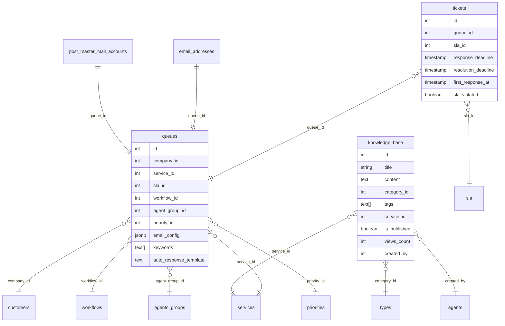

# 📋 ПЛАН: Исправление структуры БД и подготовка к Email/SLA

## 🔍 Анализ текущего состояния (обновлено 2026-03-02)

### ✅ Уже выполнено:
1. **agents** - миграция выполнена, модель обновлена (firstName, lastName, login, password, email, mobilePhone, telegramAccount, roleId)
2. **SLA** - миграция выполнена, модель обновлена (calendarId, notificationPercentage, type, solutionTime, minIncidentTime, responseNotification, updateNotification, solutionNotification)
3. **post_master_mail_accounts** - создана таблица с queue_id для привязки к очереди
4. **email_addresses** - создана с queue_id для привязки к очереди
5. **tickets** - расширена (description, ticket_comments, ticket_history, ticket_attachments, state_transitions)

### ❌ НЕ НУЖНО (связь уже есть):
- ~~queue_email_accounts~~ - связь уже существует через `emailAddresses.queueId` и `postMasterMailAccounts.queueId`

---

## 📝 ПЛАН ИСПРАВЛЕНИЙ

### Этап 1: Расширить таблицу queues

**Текущая структура:** `name, description, maxTickets, priority, templateId`

**Нужно добавить:**
- company_id (ссылка на customers)
- service_id (ссылка на services)
- sla_id (ссылка на sla)
- workflow_id (ссылка на workflows)
- agent_group_id (ссылка на agents_groups)
- priority_id (ссылка на priorities)
- email_config (JSONB) - настройки почты для очереди
- keywords (TEXT[]) - ключевые слова для авто-маршрутизации
- auto_response_template (TEXT) - шаблон авто-ответа

**SQL миграция:**
```sql
-- Расширение таблицы queues
ALTER TABLE queues 
  ADD COLUMN IF NOT EXISTS company_id INTEGER REFERENCES customers(id),
  ADD COLUMN IF NOT EXISTS service_id INTEGER REFERENCES services(id),
  ADD COLUMN IF NOT EXISTS sla_id INTEGER REFERENCES sla(id),
  ADD COLUMN IF NOT EXISTS workflow_id INTEGER REFERENCES workflows(id),
  ADD COLUMN IF NOT EXISTS agent_group_id INTEGER REFERENCES agents_groups(id),
  ADD COLUMN IF NOT EXISTS priority_id INTEGER REFERENCES priorities(id),
  ADD COLUMN IF NOT EXISTS email_config JSONB DEFAULT '{}',
  ADD COLUMN IF NOT EXISTS keywords TEXT[],
  ADD COLUMN IF NOT EXISTS auto_response_template TEXT;

-- Индексы
CREATE INDEX IF NOT EXISTS idx_queues_company ON queues(company_id);
CREATE INDEX IF NOT EXISTS idx_queues_service ON queues(service_id);
CREATE INDEX IF NOT EXISTS idx_queues_sla ON queues(sla_id);
CREATE INDEX IF NOT EXISTS idx_queues_workflow ON queues(workflow_id);
CREATE INDEX IF NOT EXISTS idx_queues_agent_group ON queues(agent_group_id);
```

**Обновить модель:** `backend/models/queues.js`
- fields: 'name, description, maxTickets, priority, companyId, serviceId, slaId, workflowId, agentGroupId, priorityId, emailConfig, keywords, autoResponseTemplate'

**Обновить контроллер:** `backend/controllers/queuesController.js`
- Добавить фильтры по company, service
- Добавить работу с emailConfig, keywords, autoResponseTemplate

---

### Этап 2: Добавить SLA дедлайны в tickets

**Нужно добавить поля:**
- response_deadline (TIMESTAMP) - крайний срок первого ответа
- resolution_deadline (TIMESTAMP) - крайний срок решения
- first_response_at (TIMESTAMP) - когда был первый ответ
- sla_violated (BOOLEAN) - нарушен ли SLA
- pending_start_at (TIMESTAMP) - начало ожидания

**SQL миграция:**
```sql
-- Дедлайны в тикетах для SLA
ALTER TABLE tickets
  ADD COLUMN IF NOT EXISTS response_deadline TIMESTAMP,
  ADD COLUMN IF NOT EXISTS resolution_deadline TIMESTAMP,
  ADD COLUMN IF NOT EXISTS first_response_at TIMESTAMP,
  ADD COLUMN IF NOT EXISTS sla_violated BOOLEAN DEFAULT false,
  ADD COLUMN IF NOT EXISTS pending_start_at TIMESTAMP;

-- Индексы для быстрого поиска
CREATE INDEX IF NOT EXISTS idx_tickets_response_deadline ON tickets(response_deadline);
CREATE INDEX IF NOT EXISTS idx_tickets_resolution_deadline ON tickets(resolution_deadline);
CREATE INDEX IF NOT EXISTS idx_tickets_sla_violated ON tickets(sla_violated);
```

**Обновить модель:** `backend/models/tickets.js`
- fields: добавить 'responseDeadline, resolutionDeadline, firstResponseAt, slaViolated, pendingStartAt'

**Обновить контроллер:** `backend/controllers/ticketsController.js`
- Автоматический расчет SLA дедлайнов при создании тикета
- Отображение SLA дедлайнов в API

---

### Этап 3: Создать таблицу knowledge_base (База Знаний)

**SQL миграция:**
```sql
-- Таблица базы знаний
CREATE TABLE IF NOT EXISTS knowledge_base (
  id SERIAL PRIMARY KEY,
  title VARCHAR(255) NOT NULL,
  content TEXT NOT NULL,
  category_id INTEGER REFERENCES types(id),
  tags TEXT[],
  service_id INTEGER REFERENCES services(id),
  is_published BOOLEAN DEFAULT false,
  views_count INTEGER DEFAULT 0,
  created_by INTEGER REFERENCES agents(id),
  created_at TIMESTAMP DEFAULT CURRENT_TIMESTAMP,
  updated_at TIMESTAMP DEFAULT CURRENT_TIMESTAMP,
  is_active BOOLEAN DEFAULT true
);

-- Индексы
CREATE INDEX IF NOT EXISTS idx_kb_title ON knowledge_base(title);
CREATE INDEX IF NOT EXISTS idx_kb_tags ON knowledge_base USING GIN(tags);
CREATE INDEX IF NOT EXISTS idx_kb_service ON knowledge_base(service_id);
CREATE INDEX IF NOT EXISTS idx_kb_published ON knowledge_base(is_published);

-- Комментарии
COMMENT ON TABLE knowledge_base IS 'База знаний - статьи и документация для агентов и клиентов';
COMMENT ON COLUMN knowledge_base.title IS 'Заголовок статьи';
COMMENT ON COLUMN knowledge_base.content IS 'Содержание статьи (Markdown/HTML)';
COMMENT ON COLUMN knowledge_base.category_id IS 'Категория статьи (ссылка на types)';
COMMENT ON COLUMN knowledge_base.tags IS 'Теги для поиска';
COMMENT ON COLUMN knowledge_base.service_id IS 'Связанный сервис';
COMMENT ON COLUMN knowledge_base.is_published IS 'Опубликована ли статья';
COMMENT ON COLUMN knowledge_base.views_count IS 'Количество просмотров';
COMMENT ON COLUMN knowledge_base.created_by IS 'Автор статьи';
```

**Модель:** `backend/models/knowledgeBase.js`
```javascript
class KnowledgeBase {
  static tableName = 'knowledge_base';
  static fields = 'title, content, categoryId, tags, serviceId, isPublished, viewsCount, createdBy';
  
  // CRUD операции
  // Поиск по тегам
  // Получение опубликованных статей
}
```

**Контроллер:** `backend/controllers/knowledgeBaseController.js`
- GET /knowledge-base - список статей (с фильтрами)
- GET /knowledge-base/:id - статья
- POST /knowledge-base - создать статью
- PUT /knowledge-base/:id - обновить статью
- DELETE /knowledge-base/:id - удалить статью
- GET /knowledge-base/search?q= - поиск по статьям
- POST /knowledge-base/:id/view - увеличить счетчик просмотров

**Роуты:** `backend/routes/knowledgeBase.js`

---

### Этап 4: Frontend для Базы Знаний

**Страницы:**

1. **Список статей** - `src/pages/apps/knowledge-base/index.vue`
   - Таблица/список статей
   - Фильтры: категория, теги, опубликованные/все
   - Поиск
   - Пагинация

2. **Просмотр статьи** - `src/pages/apps/knowledge-base/[id].vue`
   - Заголовок
   - Содержание (рендер Markdown/HTML)
   - Теги
   - Просмотры
   - Кнопка редактирования (для авторов)

3. **Редактирование/создание** - `src/pages/apps/knowledge-base/edit.vue`
   - Заголовок (input)
   - Категория (select)
   - Теги (multiselect/input)
   - Сервис (select)
   - Содержание (textarea или WYSIWYG редактор)
   - Опубликовать/Черновик (checkbox)
   - Сохранить/Отмена

4. **API для Frontend:**
   - Fake API handlers: `src/plugins/fake-api/handlers/apps/knowledge-base/`

**Компоненты:**
- `src/components/knowledge-base/KbArticle.vue` - карточка статьи
- `src/components/knowledge-base/KbSearch.vue` - поиск по базе
- `src/components/knowledge-base/KbTagCloud.vue` - облако тегов

---

### Этап 6: Frontend - Расширение форм queues ✅ ВЫПОЛНЕНО

**Файлы для обновления:**
- `src/pages/apps/settings/ticket-settings/TemplateQueues.vue` - основная форма ✅
- `src/pages/apps/settings/ticket-settings/Queues-create.vue` - форма создания ✅

**Новые поля для добавления в форму:**
1. **companyId** (select) - привязка к компании ✅
2. **serviceId** (select) - привязка к сервису ✅
3. **slaId** (select) - привязка к SLA ✅
4. **workflowId** (select) - привязка к Workflow ✅
5. **agentGroupId** (select) - привязка к группе агентов ✅
6. **priorityId** (select) - привязка к приоритету ✅
7. **emailConfig** (object) - JSON настройки email ✅
8. **keywords** (chips/multiselect) - ключевые слова для авто-маршрутизации ✅
9. **autoResponseTemplate** (textarea) - шаблон авто-ответа ✅

**Задачи:**
- [x] Добавить загрузку справочников (companies, services, sla, workflows, agentsGroups, priorities)
- [x] Обновить интерфейс Queues
- [x] Добавить поля в форму редактирования
- [x] Обновить валидацию
- [x] Протестировать создание/редактирование

---

### Этап 7: Frontend - формы tickets (SLA дедлайны) ✅ ВЫПОЛНЕНО

**Файлы для обновления:**
- `src/pages/apps/tickets/index.vue` - список тикетов ✅
- `src/pages/apps/tickets/add.vue` - создание тикета ✅
- `src/pages/apps/tickets/edit.vue` - редактирование тикета ✅

**Новые поля для отображения:**
1. **responseDeadline** - срок первого ответа ✅
2. **resolutionDeadline** - срок решения ✅
3. **firstResponseAt** - когда был первый ответ ✅
4. **slaViolated** - нарушен ли SLA ✅
5. **pendingStartAt** - начало ожидания ✅

**Задачи:**
- [x] Добавить колонки в таблицу тикетов (responseDeadline, resolutionDeadline, slaViolated)
- [x] Добавить визуальный индикатор SLA (цвет: зеленый - в норме, желтый - скоро истекает, красный - нарушен)
- [x] Отобразить SLA дедлайны в карточке тикета
- [x] Автоматический расчет дедлайнов при создании (на основе SLA)
- [x] Протестировать отображение

Добавить информацию о:
- Новых полях в queues
- Новых полях в tickets
- Таблице knowledge_base
- Связях через queueId в emailAddresses и postMasterMailAccounts

---

## 🔄 Обновление моделей (backend/models/)

### 1. queues.js
```javascript
static fields = 'name, description, maxTickets, priority, companyId, serviceId, slaId, workflowId, agentGroupId, priorityId, emailConfig, keywords, autoResponseTemplate';
```

### 2. tickets.js
```javascript
static fields = 'ticketNumber, title, description, typeId, priorityId, queueId, stateId, ownerId, companyId, slaId, responseDeadline, resolutionDeadline, firstResponseAt, slaViolated, pendingStartAt';
```

### 3. knowledgeBase.js (NEW)
```javascript
static fields = 'title, content, categoryId, tags, serviceId, isPublished, viewsCount, createdBy';
```

---

## 🎨 Frontend - Расширение форм

### 1. queues - расширить форму
- Привязка компании (companyId)
- Привязка сервиса (serviceId)
- Привязка SLA (slaId)
- Привязка Workflow (workflowId)
- Привязка группы агентов (agentGroupId)
- Приоритет по умолчанию (priorityId)
- Email настройки (emailConfig) - host, port, username, password
- Ключевые слова (keywords)
- Шаблон авто-ответа (autoResponseTemplate)

### 2. tickets - добавить
- Отображение SLA дедлайнов
- Индикатор нарушения SLA
- Блок "Следующий ответ до" / "Решить до"

---

## 📊 Связи после исправления



---

## ❓ Вопрос про объединение users и agents

**Текущая структура:**
- `users` - клиентские пользователи (контактные лица компаний)
- `agents` - сотрудники поддержки

**Можно ли объединить в одну таблицу с ролями?**

Технически - да, но **не рекомендуется** по следующим причинам:

1. **Разные сценарии использования:**
   - Agents: вход в систему, аутентификация, роли, права доступа
   - Users: контактные данные клиента, привязка к компании

2. **Разные поля:**
   - Agents: login, password, telegramAccount, mobilePhone, roleId
   - Users: company_id, message (заметки)

3. **Безопасность:**
   - Agents должны иметь доступ к админке
   - Users - только к своим тикетам (клиентский портал)

4. **Производительность:**
   - Разделение упрощает запросы
   - Agents запрашиваются чаще (при назначении тикетов)

**Рекомендация:** Оставить две отдельные таблицы, но:
- Agents может ссылаться на Users как на контактное лицо
- Добавить связь agents → users (например, для учета "сотрудник является контактным лицом своей компании")

---

## ✅ Чеклист выполнения

- [x] 1. Создать миграцию add-fields-to-queues.sql
- [x] 2. Обновить модель queues.js
- [x] 3. Обновить контроллер queuesController.js
- [x] 4. Создать миграцию add-sla-deadlines-to-tickets.sql
- [x] 5. Обновить модель tickets.js
- [x] 6. Обновить контроллер ticketsController.js
- [x] 7. Создать миграцию create-knowledge-base.sql
- [x] 8. Создать модель knowledgeBase.js
- [x] 9. Создать контроллер knowledgeBaseController.js
- [x] 10. Создать роуты knowledgeBase.js
- [x] 11. Создать Frontend страницы для Базы Знаний
- [x] 12. Обновить DATABASE_SCHEMA.md

---

*План обновлен: 2026-03-02*
