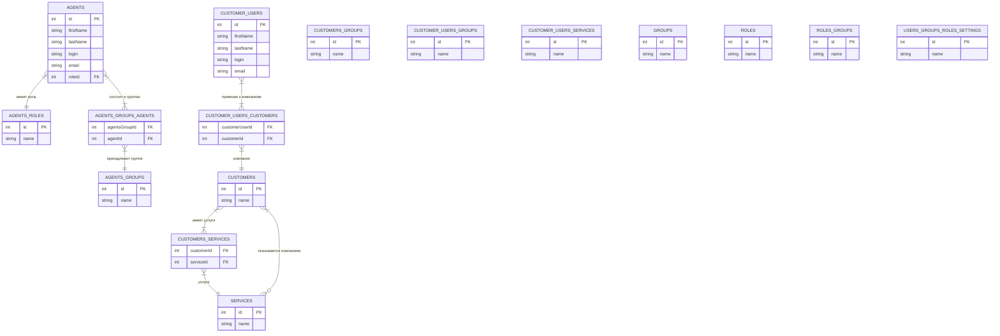

# Анализ справочников: Пользователи, Агенты, Клиенты

## Содержание

1. [Текущая структура справочников](#текущая-структура)
2. [Выявленные проблемы](#выявленные-проблемы)
3. [Отсутствующие связи](#отсутствующие-связи)
4. [Рекомендации](#рекомендации)

---

## Текущая структура

### Справочники в БД

| № | Таблица | Фронтенд | Назначение |
|---|---------|----------|------------|
| 1 | `users` | Нет UI | Пользователи системы (не используется) |
| 2 | `agents` | Agents.vue | Агенты (сотрудники поддержки) |
| 3 | `agents_groups` | AgentsGroups.vue | Группы агентов |
| 4 | `agents_roles` | AgentsRoles.vue | Роли агентов |
| 5 | `agents_groups_agents` | (связь) | Связь агентов с группами |
| 6 | `customers` | Customers.vue | Компании (клиенты-юридические лица) |
| 7 | `customers_groups` | CustomersGroups.vue | Группы клиентов |
| 8 | `customer_users` | CustomerUsers.vue | Контактные лица клиентов |
| 9 | `customer_users_groups` | CustomerUsersGroups.vue | Группы контактных лиц |
| 10 | `customer_users_customers` | CustomerUsersCustomers.vue | Связь контактов с компаниями |
| 11 | `customer_users_services` | CustomerUsersServices.vue | Услуги для контактов |
| 12 | `services` | Services.vue | Услуги |
| 13 | `groups` | Groups.vue | Общие группы |
| 14 | `roles` | Roles.vue | Роли |
| 15 | `roles_groups` | RolesGroups.vue | Группы ролей |
| 16 | `users_groups_roles_settings` | UsersGroupsRolesSettings.vue | Настройки ролей |
| 17 | `customers_services` | (связь) | Связь компаний с услугами |

---

## Выявленные проблемы

### 1. Дублирование "Групп" (Лишнее)

В системе существует 6 различных типов групп:

| Группа | Назначение | Проблема |
|--------|------------|----------|
| `agents_groups` | Группы агентов | OK |
| `customers_groups` | Группы компаний | OK |
| `customer_users_groups` | Группы контактов | OK |
| `roles_groups` | Группы ролей | **Сомнительно** |
| `groups` (общая) | Универсальная | **Лишняя** |
| `users_groups_roles_settings` | Настройки ролей | **Лишняя** |

**Проблема:** Таблицы `groups` и `users_groups_roles_settings` не имеют четкого назначения и дублируют функциональность других справочников.

### 2. Дублирование "Групп клиентов"

В списке упоминаются "Группы клиентов" дважды:
- `customers_groups` - группы компаний
- `customer_users_groups` - группы контактных лиц

Это разные сущности, но возможно пользователь ожидает единый справочник "Группы клиентов".

### 3. Дублирование "Ролей"

В системе три типа ролей:
- `agents_roles` - роли агентов
- `roles` - универсальные роли
- Настройки в `users_groups_roles_settings`

**Рекомендация:** Объединить в единую систему ролей.

### 4. Неиспользуемая таблица `users`

Таблица `users` существует, но:
- Нет UI для управления пользователями
- Агенты (`agents`) используют свои собственные поля для аутентификации
- Дублирование функциональности

---

## Отсутствующие связи

### Диаграмма текущих связей



### Отсутствующие связи (что нужно добавить)

| Связь | Откуда | Куда | Статус |
|-------|--------|------|--------|
| Агент → Роль | agents | agents_roles | ✅ Есть (role_id) |
| Агент → Группы | agents | agents_groups | ✅ Есть (agents_groups_agents) |
| Контакт → Компания | customer_users | customers | ✅ Есть (customer_users_customers) |
| Контакт → Группы | customer_users | customer_users_groups | ❌ **Нет** |
| Компания → Группы | customers | customers_groups | ❌ **Нет** |
| Контакт → Услуги | customer_users | customer_users_services | ❌ **Нет** |
| Агент → Пользователь | agents | users | ❌ **Нет** |

---

## Рекомендации

### 1. Удалить лишние справочники

**Удалить:**
- `groups` (дублирует специализированные группы)
- `users_groups_roles_settings` (дублирует roles и roles_groups)

### 2. Добавить недостающие связи

**Добавить M2M связи:**

| Связь | Таблица |
|-------|---------|
| customers ↔ customers_groups | `customers_customers_groups` |
| customer_users ↔ customer_users_groups | `customer_users_customer_users_groups` |
| customer_users ↔ customer_users_services | `customer_users_customer_users_services` |

### 3. Добавить поля в существующие таблицы

**agents:**
- Добавить поле `user_id` для связи с системными пользователями (если нужно)

**customers:**
- Добавить связь с `customers_groups` (через новую таблицу)

### 4. Уточнить бизнес-логику "Услуг клиентов"

Сейчас есть:
- `services` - общие услуги
- `customer_users_services` - услуги для контактов (дублирование?)

**Вопрос:** Для чего нужны `customer_users_services` если есть `services`?

### 5. Возможная оптимизация структуры

Текущая структура "клиенты → контакты" сложна. Возможные упрощения:

**Вариант А (текущий):**
```
customer (компания)
  └─ customer_user (контакт)
       └─ customer_users_customer (связь с компанией - непонятно зачем)
```

**Вариант Б:**
```
customer (компания)
  └─ customer_user (контакт)
       └─ customer_user_service (услуги контакта)
```

---

## Сводка по изменениям

| Действие | Приоритет | Сложность |
|----------|-----------|-----------|
| Удалить таблицу `groups` | Высокий | Низкая |
| Удалить таблицу `users_groups_roles_settings` | Высокий | Низкая |
| Добавить связь customers ↔ customers_groups | Высокий | Средняя |
| Добавить связь customer_users ↔ customer_users_groups | Высокий | Средняя |
| Уточнить назначение customer_users_services | Средний | Требует уточнения |

---

## Вопросы для уточнения

1. **Для чего используется таблица `users`?** Если не нужна - удалить.
2. **Для чего нужны `customer_users_customers` и `customer_users_services`?** Это явное дублирование логики.
3. **Какова цель универсальных `groups` и `roles`?** Если только для совместимости - удалить.
4. **Связь между agents и users?** Планируется ли единая система аутентификации?
