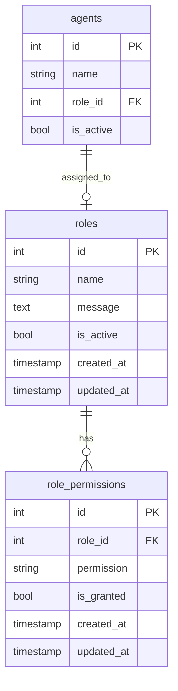

# План реализации системы разрешений (привилегий) для ролей

## Текущее состояние

- Таблица `roles` содержит: id, name, message, is_active, created_at, updated_at
- В таблице `agents` уже есть поле `role_id`
- Агенты могут иметь роль, но нет системы разрешений

## Требуемые разрешения (на основе требований пользователя)

| Код разрешения | Описание | Пользователь | Агент |
|---------------|----------|-------------|-------|
| create_ticket | Создание заявки | ✅ | ✅ |
| see_own_tickets | Видеть только свои заявки | ✅ | ❌ |
| reply_to_tickets | Отвечать на заявки | ❌ | ✅ |
| internal_notes | Внутренние заметки | ❌ | ✅ |
| change_status | Менять статус/приоритет | ❌ | ✅ |
| kb_read | Доступ к БЗ (чтение) | ✅ | ✅ |
| kb_write | Доступ к БЗ (создание/редактирование) | ❌ | ✅ |
| system_settings | Настройка системы | ❌ (Admin) | ❌ |
| view_reports | Просмотр отчётов | ❌ | ✅ |
| manage_users | Управление пользователями | ❌ | ⚠️ |
| see_all_tickets | Видеть все заявки (уровень доступа) | ❌ | ✅ |
| see_department_tickets | Видеть заявки отдела | ❌ | ✅ |
| see_company_tickets | Видеть заявки компании | ❌ | ✅ |

---

## Этапы реализации

### Этап 1: База данных

1. **Создать таблицу `role_permissions`** - связь ролей с разрешениями
   - id (SERIAL)
   - role_id (INTEGER, FK -> roles)
   - permission (VARCHAR) - код разрешения
   - is_granted (BOOLEAN) - разрешено/запрещено
   - created_at, updated_at

2. **Добавить поле в `users` таблицу** (опционально для клиентских пользователей)
   - role_id (INTEGER, FK -> roles)

### Этап 2: Backend

1. **Обновить модель `Roles`**:
   - Добавить методы для работы с разрешениями
   - Метод `getPermissions(roleId)` - получить все разрешения роли
   - Метод `setPermissions(roleId, permissions)` - установить разрешения
   - Метод `hasPermission(roleId, permission)` - проверить разрешение

2. **Обновить контроллер `rolesController`**:
   - GET `/roles/:id/permissions` - получить разрешения роли
   - PUT `/roles/:id/permissions` - обновить разрешения роли

3. **Создать API для проверки разрешений**:
   - GET `/agents/:id/permissions` - получить разрешения агента
   - Middleware для проверки разрешений

### Этап 3: Frontend

1. **Создать компонент `RolePermissions.vue`**:
   - Таблица/список всех доступных разрешений
   - Переключатели (VSwitch) для каждого разрешения
   - Группировка по категориям

2. **Обновить страницу редактирования роли**:
   - Добавить вкладку/секцию "Разрешения"
   - Интегрировать компонент RolePermissions

3. **Создать composable `usePermissions`**:
   - Хук для проверки разрешений в компонентах
   - Кэширование разрешений

### Этап 4: Интеграция

1. **Обновить контроллер тикетов**:
   - Проверка разрешений при создании тикета
   - Проверка разрешений при просмотре тикетов
   - Фильтрация по уровню доступа

2. **Обновить интерфейс агентов**:
   - Показывать/скрывать элементы на основе разрешений
   - Блокировать действия без разрешений

---

## Структура данных



---

## UI Схема

```
┌─────────────────────────────────────────────────────────┐
│ Роль: Администратор                              [Сохранить]│
├─────────────────────────────────────────────────────────┤
│ [Основное] [Разрешения]                                  │
├─────────────────────────────────────────────────────────┤
│                                                         │
│ Тикеты                                                 │
│ ├ ☑ create_ticket      Создание заявок                  │
│ ├ ☑ see_own_tickets    Видеть только свои заявки        │
│ ├ ☑ reply_to_tickets   Отвечать на заявки              │
│ ├ ☑ internal_notes     Внутренние заметки              │
│ ├ ☑ change_status      Менять статус/приоритет         │
│ ├ ☐ see_all_tickets    Видеть все заявки               │
│ ├ ☐ see_department_tickets  Видеть заявки отдела      │
│ └ ☐ see_company_tickets     Видеть заявки компании     │
│                                                         │
│ База знаний                                            │
│ ├ ☑ kb_read         Доступ к БЗ (чтение)               │
│ └ ☑ kb_write        Доступ к БЗ (запись)              │
│                                                         │
│ Отчёты и настройки                                     │
│ ├ ☐ view_reports    Просмотр отчётов                   │
│ └ ☐ system_settings Настройка системы                  │
│                                                         │
└─────────────────────────────────────────────────────────┘
```

---

## Примеры API

### Получить разрешения роли
```json
GET /api/roles/1/permissions

Response:
{
  "permissions": {
    "create_ticket": true,
    "see_own_tickets": true,
    "reply_to_tickets": false,
    "view_reports": false
  }
}
```

### Установить разрешения роли
```json
PUT /api/roles/1/permissions

Body:
{
  "permissions": {
    "create_ticket": true,
    "see_own_tickets": true,
    "reply_to_tickets": true,
    "view_reports": true
  }
}
```

---

## Вопросы для уточнения

1. Как реализовать "Супер пользователь" - отдельная роль или флаг в разрешениях?
2. Нужно ли разграничивать разрешения для клиентских пользователей (users)?
3. Как учитывать группу/отдел при проверке разрешений?
4. Нужна ли иерархия ролей (роли наследуют разрешения от других ролей)?


## Ответы на  уточнения

1. Как реализовать "Супер пользователь" - офлаг в разрешениях --да 
2. Да разграничь 
3. Как учитывать группу/отдел при проверке разрешений? для групп агентов есть назначения на очереди  в очереди есть настройка  Сорвис , а
4. Скорее да чем нет Агент может работать только  с сервисами укзаных в очереди  , сервисов в одной очереди может быть несколько ,  агент может быть назначен  на разные очереди  наверно  роль нужно привязывать к сервису
