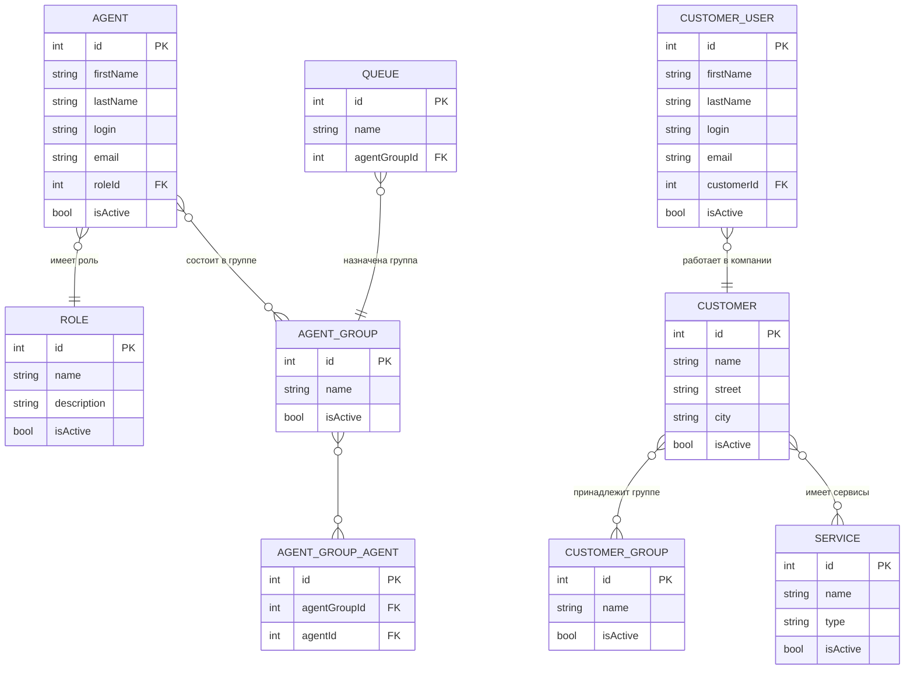

# Анализ и план реорганизации модуля "Пользователи, группы и роли"

## Текущее состояние

На основе анализа кода и схемы БД выявлена следующая структура:

### Таблицы БД (сущности)

| Таблица | Назначение | Комментарий |
|---------|-----------|-------------|
| `agents` | Агенты (сотрудники поддержки) | Имеют role_id |
| `agents_groups` | Группы агентов | Привязываются к очередям (queues.agent_group_id) |
| `agents_groups_agents` | Связь агентов с группами | M2M |
| `roles` | Роли | Назначаются агентам |
| `roles_groups` | ??? | Непонятное назначение |
| `agents_roles` | ??? | Похоже на дублирование roles |
| `customers` | Компании-клиенты | |
| `customers_groups` | Группы компаний-клиентов | |
| `customer_users` | Сотрудники компаний-клиентов | Те, кто создаёт заявки |
| `customer_users_groups` | ??? | |
| `customer_users_customers` | Связь пользователей с компаниями | |
| `customer_users_services` | ??? | |
| `groups` | Общие группы пользователей системы | |
| `users` | Системные пользователи (для авторизации) | |

### Текущие страницы (URL)

```
/apps/settings/users-groups-roles/Agents           - Агенты
/apps/settings/users-groups-roles/AgentsGroups     - Группы агентов
/apps/settings/users-groups-roles/AgentsRoles      - ??? (непонятно)
/apps/settings/users-groups-roles/Customers        - Компании-клиенты
/apps/settings/users-groups-roles/CustomersGroups - Группы компаний
/apps/settings/users-groups-roles/CustomerUsers    - Сотрудники компаний
/apps/settings/users-groups-roles/CustomerUsersGroups   - ???
/apps/settings/users-groups-roles/CustomerUsersCustomers - ???
/apps/settings/users-groups-roles/CustomerUsersServices  - ???
/apps/settings/users-groups-roles/Groups          - Группы пользователей
/apps/settings/users-groups-roles/Roles           - Роли
/apps/settings/users-groups-roles/RolesGroups     - ???
/apps/settings/users-groups-roles/UsersGroupsRolesSettings - ???
```

---

## Анализ проблем

### 1. Избыточные и непонятные сущности

| Сущность | Проблема |
|----------|----------|
| `agents_roles` | Дублирует таблицу `roles`. Если `roles` - это роли агентов, то `agents_roles` лишняя |
| `roles_groups` | Непонятно назначение. Если это "группы ролей" - непонятно зачем |
| `customer_users_groups` | Непонятно - это группы сотрудников внутри компании? |
| `customer_users_services` | Странная связь - сотрудники к сервисам? |
| `users_groups_roles_settings` | Непонятная сущность |

### 2. Несоответствие названий

- `Groups` - непонятно какие группы (пользователей системы? агентов?)
- Смешение понятий "агенты поддержки" и "сотрудники клиентов"

### 3. Функциональные проблемы

- Нет явной привязки ролей к агентам через интерфейс
- Нет чёткого разделения между "сотрудниками поддержки" и "сотрудниками клиентов"
- AgentsGroups не связана с Roles

---

## Предлагаемая архитектура

### Концептуальная модель



---

## Рекомендуемая структура страниц

### Вариант 1: Простая структура (рекомендуемый)

| Раздел | Страница | Содержимое |
|--------|----------|-------------|
| **Агенты** | Agents | Список агентов с редактированием |
| | AgentsGroups | Группы агентов + состав группы |
| | Roles | Роли (Админ, Менеджер, и т.д.) |
| **Клиенты** | Customers | Компании-клиенты |
| | CustomersGroups | Группы компаний |
| | CustomerUsers | Сотрудники компаний |
| | Services | Сервисы/услуги для клиентов |

### Вариант 2: С группировкой

```
Агенты и роли/
├── Агенты
├── Группы агентов  
├── Роли
└── Настройки прав (объединить RolesGroups + UsersGroupsRolesSettings)

Клиенты/
├── Компании
├── Группы компаний
├── Сотрудники компаний
└── Сервисы
```

---

## План реорганизации

### Этап 1: Анализ и документирование текущего использования

- [ ] Проверить фактическое использование таблиц agents_roles, roles_groups
- [ ] Проверить как используются customer_users_groups, customer_users_services
- [ ] Определить реальные данные в каждой таблице

### Этап 2: Очистка базы данных (опционально)

- [ ] Удалить неиспользуемые таблицы или объединить их
- [ ] Создать миграции для очистки

### Этап 3: Реорганизация страниц

- [ ] Объединить AgentsRoles в страницу Roles (или удалить)
- [ ] Объединить RolesGroups в страницу Roles  
- [ ] Удалить или переосмыслить CustomerUsersGroups
- [ ] Удалить или переосмыслить CustomerUsersServices
- [ ] Переименовать/объединить Groups в зависимости от назначения

### Этап 4: Реализация привязки групп к очередям

- [ ] Добавить UI для выбора группы агентов в очереди
- [ ] Реализовать логику назначения тикетов на группу

---

## Рекомендации по реализации

### Что оставить (нужные сущности)

1. **Agents** - сотрудники поддержки
2. **AgentsGroups** - группы агентов (нужны для очередей!)
3. **Roles** - роли (Админ, Супервизор, Агент 1-й линии, и т.д.)
4. **Customers** - компании-клиенты
5. **CustomersGroups** - группы компаний (отделы клиентов)
6. **CustomerUsers** - сотрудники компаний (пользователи тикетов)
7. **Services** - сервисы/услуги

### Что удалить или переосмыслить

1. **agents_roles** - удалить (дублирует roles)
2. **roles_groups** - удалить (непонятное назначение)
3. **customer_users_groups** - возможно удалить или переименовать
4. **customer_users_services** - переименовать в связи клиент-сервис
5. **groups** - переименовать или удалить (дублирует agents_groups?)

### Что добавить

1. **AgentsRoles** - связующая таблица агент-роль (уже есть agents.role_id, но нужна M2M?)
2. Явная привязка групп агентов к очередям (уже есть agent_group_id в queues)

---

## Вопросы для уточнения

1. **Groups** (общая таблица) - для чего она нужна? Это группы для системных пользователей?

2. **Roles** - это роли только для агентов или для всех пользователей системы?

3. **CustomerUsersGroups** - это группы внутри компании (отделы) или что-то другое?

4. **CustomerUsersServices** - для чего связывать сотрудников с сервисами?

5. Привязка групп к очередям - нужно ли показывать список агентов в группе при редактировании очереди?
